# ClassRosterPro User Guide
## About This Guide
Welcome to the ClassRosterPro User Guide!
This guide is designed to help you, a private tutor, efficiently manage all your student information in one place.
* If you are a new user, we highly recommend starting with the "Quick Start"
section to get set up and run your first command in just 5 minutes
* If you are an experienced user, jump directly to the "Features" section for a complete list of commands.
* Look out for Tips and Common Mistakes icons to help you use ClassRosterPro more effectively.

## Introduction
Juggling student contacts, lesson schedules, and notes across different notebooks and apps?
**ClassRosterPro** is a powerful desktop application built for private tutors
to **centralize and manage all their student details.**

While it has a clean Graphical User Interface (GUI), it is optimized for use via a Command Line Interface (CLI).
If you can type fast, you can manage your student **roster—finding,
updating, and organizing** much faster than with a mouse.

Use Cases:
* Quickly add a new student after a trial lesson with their contact details and subject tag.
* Use tags to mark students so you can filter and view them as a group.
* Instantly update a student's phone number when they get a new one.
* Use the open command to see a student's full profile, including your notes and their upcoming lesson schedule,
all in one expanded view.

Table of Contents
{:toc}

--------------------------------------------------------------------------------------------------------------------

## Quick start

1. Ensure you have Java `17` or above installed in your Computer. 
   **Mac users:** Ensure you have the precise JDK version prescribed [here](https://se-education.org/guides/tutorials/javaInstallationMac.html).

2. Download the latest `ClassRosterPro.jar` file from [here](https://github.com/AY2526S1-CS2103T-W13-4/tp/releases).

3. Copy the file to the folder you want to use as the _home folder_ for your ClassRosterPro.

4. In the home folder, right click and select `Open in Terminal`

5. Use the `java -jar classrosterpro.jar` command to run the application. 
   A GUI similar to the below should appear in a few seconds. Note how the app contains some sample data. 
   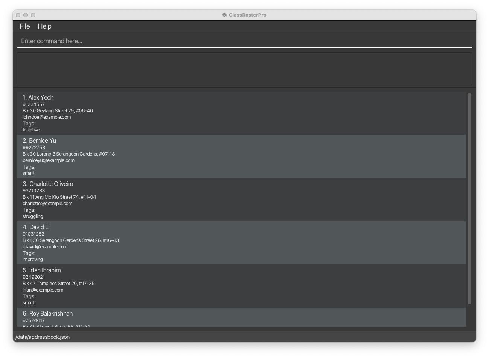

6. Type the command in the command box and press Enter to execute it.
For example, typing **`help`** and pressing Enter will open the help window. 
7. Try adding your first student using the command:

   `add n/John Doe p/98765432 e/johnd@example.com a/John street, block 123, #01-01 t/Math t/Grade10`

   _This command adds a student named "John Doe" with his phone, email, address, and two tags indicating he's a Grade 10 Math student._

Some example commands you can try:

   * `list` : Lists all students.

   * `open 1` : Expands the student's contact card for the first student in the current list.

   * `delete 3` : Deletes the 3rd student shown in the current list.

   * `clear` : Deletes all students.

   * `exit` : Exits the app.

Refer to the [Features](#features) below for details of each command.

--------------------------------------------------------------------------------------------------------------------

## Features

**:information_source: Notes about the command format:** 

* Words in `UPPER_CASE` are the parameters to be supplied by the user. 
  e.g. in `add n/NAME`, `NAME` is a parameter which can be used as `add n/John Doe`.

* Items in square brackets are optional. 
  e.g `n/NAME [t/TAG]` can be used as `n/John Doe t/Grade10` or as `n/John Doe`.

* Items with `…`​ after them can be used zero or multiple times. 
  e.g. `[t/TAG]…​` can be used as `t/friend` or `t/friend t/family`

* Parameters can be in any order. 
  e.g. if the command specifies `n/NAME p/PHONE_NUMBER` then `p/PHONE_NUMBER n/NAME` is also acceptable.

* Extraneous parameters for commands that do not take in parameters (such as `help`, `list`, `exit` and `clear`) will be ignored. 
  e.g. if the command specifies `help 123`, it will be interpreted as `help`.

* If you are using a PDF version of this document, be careful when copying and pasting commands that span
multiple lines as space characters surrounding line-breaks may be omitted when copied over to the application.

### Viewing help : `help`

Displays a pop-up window containing a complete list of all available commands, grouped by category

Format: `help`

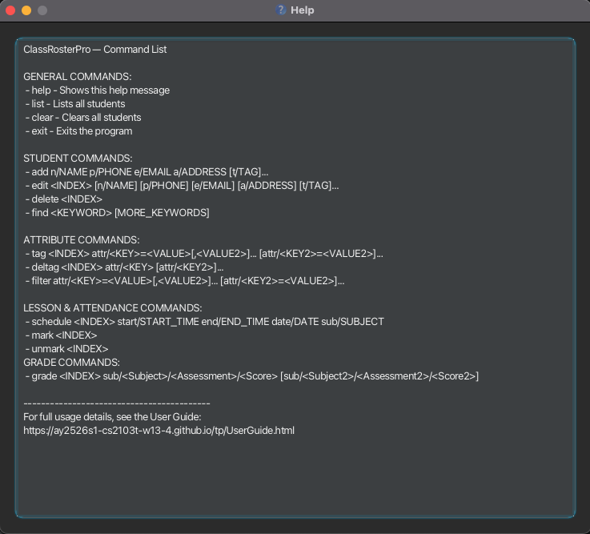

<em>Pop-up window after entering the `help` command </em>

### Adding a student: `add`

Adds a new student to your ClassRosterPro.

Format: `add n/NAME p/PHONE_NUMBER e/EMAIL a/ADDRESS [t/TAG]…​`

* The student's NAME, PHONE_NUMBER, EMAIL and ADDRESS must be provided.
* Tags [t/TAG] are optional. You can use them to group students by subject, level, or status.

Examples:
* `add n/Betsy Crowe p/91234567 e/betsyc@example.com a/123 Bishan Street t/Physics t/ALevels t/NeedsHomeworkCheck`

_Adds a student named "Betsy Crowe" for A-Level Physics and flags her as needing a homework check._
* `add n/John Doe p/98765432 e/johnd@example.com a/Home Studio`

_Adds a student named "John Doe" with only the compulsory fields. Useful for a quick add after a trial lesson._

:bulb: Tip:
A student can have none or multiple tags.

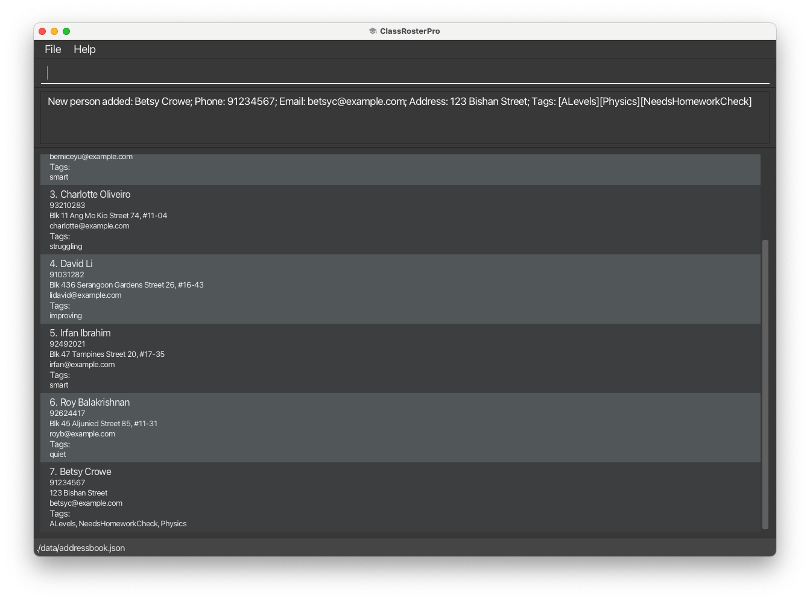

<em>Success message displayed and new student added.</em>

### Listing all persons : `list`

Shows a list of all students in your roster.

Format: `list`

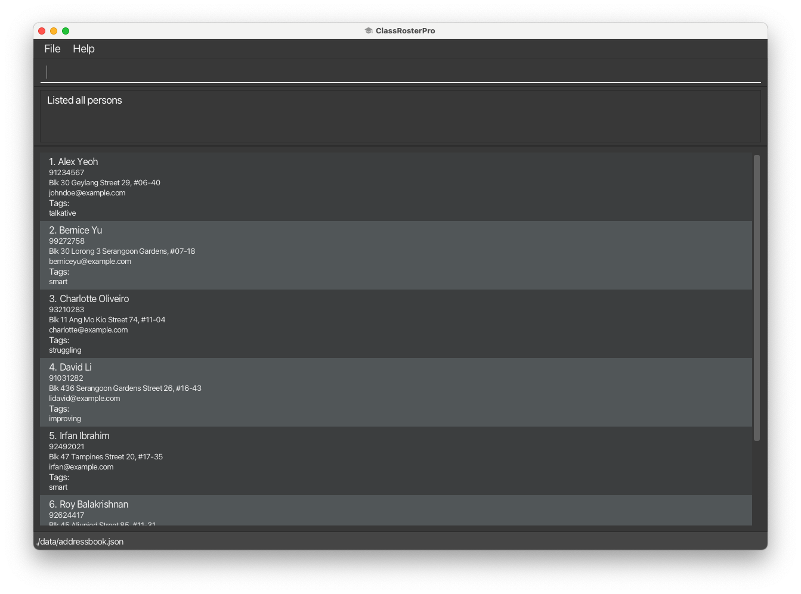

<em>All students are displayed</em>

### Viewing full student details: `open`
Expands a student's card to view all their details, including additional attributes and scheduled lessons.

Format: `open INDEX`

* Expands the student card at the specified INDEX.
* The index refers to the position number shown in the currently displayed student list.
* The index must be a positive integer 1, 2, 3, …​

Examples:
* `open 1`

_Opens the card of the 1st student in the current list. If you have just filtered the list,
this will be the first student in the filtered results._

:bulb: Tip:
Use this command to quickly check a student's lesson schedule or the notes you've added to their profile before a session.

:warning: Common Mistake:
Using an index that is out of range (e.g., open 0 or open 10 when there are only 5 students displayed).

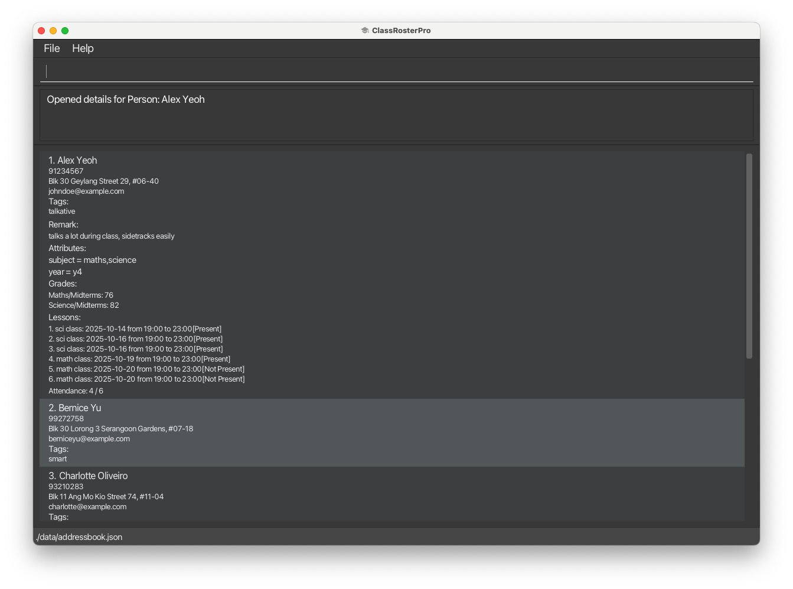

<em>Alex's contact card expanded.</em>

### Collapsing a student card : `close`
Collapses an expanded student card back to the compact view.

Format: `close INDEX`

* Collapses the student card at the specified INDEX.
* The index refers to the position number shown in the currently displayed student list.
* The index must be a positive integer 1, 2, 3, …​

Examples:
* `close 1`

_Collapses the card of the 1st student in the current list._

:bulb: Tip:
Collapsing cards you aren't currently viewing helps declutter the interface and makes it easier to scroll through your student list.

:warning: Common Mistake:
Trying to close a card that is already collapsed. The command will have no visible effect.

<em>Alex's contact card collapsed.</em>

### Editing a person : `edit`

Edits the details of an existing student in your list.

Format: `edit INDEX [n/NAME] [p/PHONE] [e/EMAIL] [a/ADDRESS] [t/TAG]…​`

* Edits the student at the specified `INDEX`.
* The index refers to the index number shown in the displayed contact list.
* The index **must be a positive integer** 1, 2, 3, …​
* At least one of the optional fields must be provided.
* Existing values will be updated to the input values.
* When editing tags, the existing tags of the student will be removed i.e adding of tags is not cumulative.
* You can remove all the person’s tags by typing `t/` without specifying any tags after it.

Examples:
* `edit 1 p/91234567 e/johndoe@example.com`

_Edits the phone number and email address of the 1st student to be 91234567 and johndoe@example.com respectively.
The student's name, address, and tags remain unchanged._

* `edit 2 n/Betsy Crower t/`
Edits the name of the 2nd student to be Betsy Crower and clears all existing tags.

:bulb: Tip:
You can remove all of a student's tags by using t/ without specifying any tags after it.

:warning: Common Mistake:
Assuming the index is based on the original list. Remember, it is based on the current list (e.g., after a list or filter command).

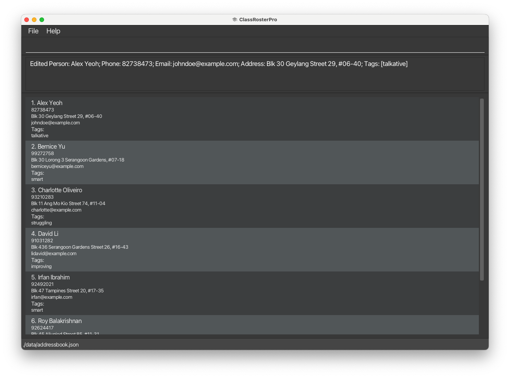

<em>Figure: Result of editing a student.</em>

### Deleting a person : `delete`

Deletes the specified student from your roster.

Format: `delete INDEX`

* Deletes the person at the specified `INDEX`.
* The index refers to the index number shown in the displayed person list.
* The index **must be a positive integer** 1, 2, 3, …​

Examples:
* `list` followed by `delete 2`

_Deletes the 2nd student in the roster._

* `filter Math` followed by `delete 1`

_Deletes the 1st student in the results of the filter command._

:warning: Common Mistake:
Double-check the index before deleting, as this action cannot be undone.

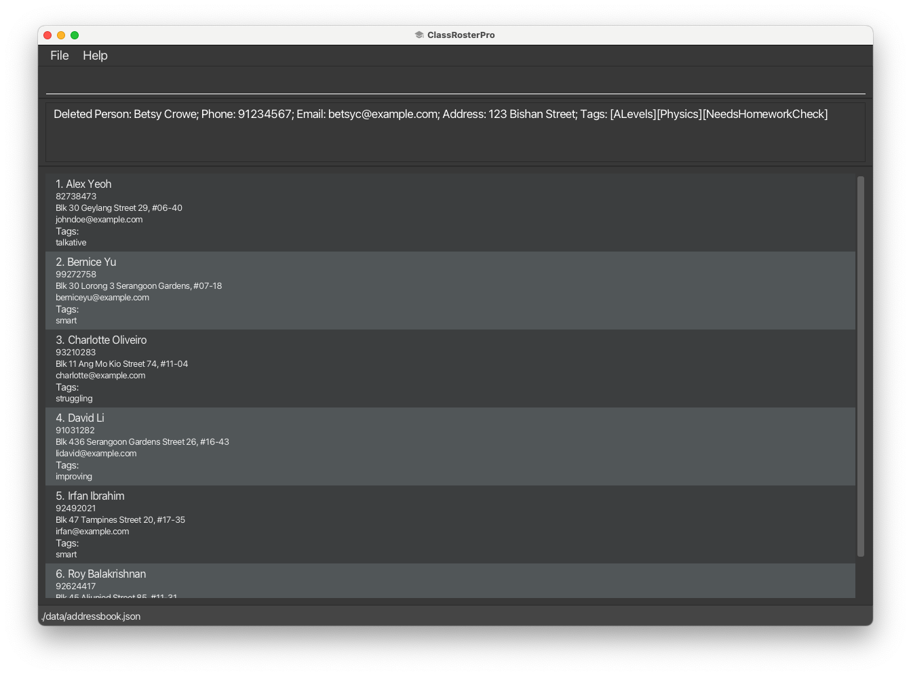

<em>Betsy Crowe has been removed from the roster.</em>

### Tagging a student with attributes : `tag`

Adds or updates descriptive attributes for a specific student, such as their subject, age, house, or CCA.

Format:
`tag INDEX attr/KEY=VALUE[,VALUE2]…​ [attr/KEY2=VALUE2]…​`

* Adds or updates the attributes of a student at the specified `INDEX`.
* The index refers to the index number shown in the current list.
* The index **must be a positive integer** 1, 2, 3, …​
* If the same attribute key already exists (e.g., `subject`), it will be replaced by the new values.
* Attributes can have one or multiple comma-separated values.
* If you use the same key multiple times, only the **last occurrence** is applied.
* At least one `attr/` prefix must be provided.

Examples:
* `tag 2 attr/subject=math,science attr/age=16`

_Adds attributes `subject` and `age=16` to the 2nd student._

:bulb: Tip:
Use this command when you want to add additional attributes to a student without affecting their existing tags.

:warning: Common Mistake:
Using the same tag multiple times - duplicate tags will be ignored.

<em>Bernice is tagged with 2 attributes.</em>

### Removing tags from a student : `deltag`

Removes one or more specific tags from an existing student.

Format:
`deltag INDEX attr/KEY [attr/KEY2]…​`

* Deletes the specified attribute(s) from the student at the specified INDEX.
* The index refers to the index number shown in the displayed student list.
* The index **must be a positive integer** 1, 2, 3, …
* At least one `attr/` prefix must be provided.
* Multiple attributes can be deleted at once by adding `attr/<attribute>`.
* Only the specified attributes are deleted — other attributes remain unchanged.

Examples:
* `deltag 1 attr/subject`

_Deletes the attribute subject from the 1st student._

* `deltag 2 attr/age attr/subject`

_Deletes multiple attributes (age, subject) from the 3rd student._

:bulb: Tip:
Use this when a student's status changes (e.g., they're no longer a "NewStudent" or have cleared their "BehindPayment" status).

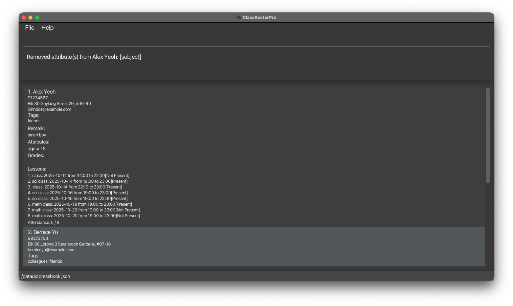

<em>Bernice's tags has been removed.</em>

### Filtering students by attributes : `filter`

Filters and displays students whose tags contains any of the specified attributes.

Format: `filter attr/KEY=VALUE[,VALUE2]…​ [attr/KEY2=VALUE2]…​`

* The filter is case-insensitive for both attribute keys and values.
* The order of the keywords does not matter. e.g. `Math Grade10` will return the same students as `Grade10 Math`.
* All specified attribute filters must match for a student to be included
(i.e. A student that does not have ALL of the specified attributes will not be displayed).
* Multiple values for the same attribute are separated by commas.
* At least one `attr/` prefix must be provided.
* For age attributes, values must be valid integers.

Examples:
* `filter attr/subject=math`

_Shows students tagged with "math" as their subject_

* `filter attr/subject=math,science attr/age=16`

_Shows students who have either "math" or "science" as subject AND are age 16_

* `filter attr/age=15,16,17`

_Shows students who are 15, 16, or 17 years old_

:bulb: Tip:
Use this to quickly find all students in a particular subject or with a specific status flag.

:warning: Common Mistake:
Searching for partial words - the filter only matches complete tag words.

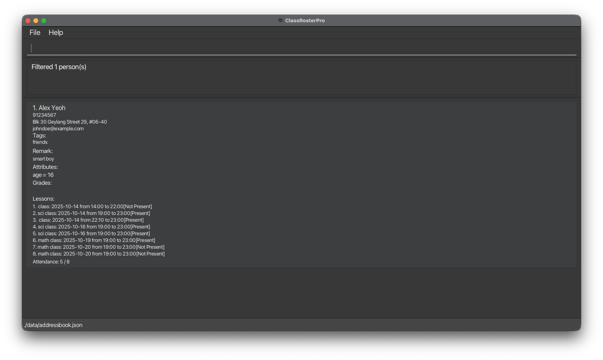

<em>Students with the attribute `Math` are displayed.</em>

### Scheduling a lesson : `schedule`

Schedule a lesson foe a student with date, time and duration.

Format:
`schedule INDEX start/START_TIME end/END_TIME date/DATE sub/SUBJECT`

* Schedules a lesson for the student at the specified `INDEX`.
* The index **must be a positive integer** 1, 2, 3, …
* Times use 24-hour `HH:mm` (e.g., `09:30`, `14:00`) and dates use `YYYY-MM-DD` (e.g., `2025-09-20`).
* `END_TIME` must be strictly later than `START_TIME`.
* Overlapping lessons for the same student on the same date are rejected.
* Exact duplicates (same student, date, start, end, subject) are not added.

Examples:
* `schedule 2 start/13:00 end/14:00 date/2025-09-20 sub/Maths`

_Schedules specified lesson for the 2nd person in the current list_

:warning: Common Mistake:
Using 12-hour time format instead of 24-hour format or incorrect date format (must be YYYY-MM-DD).

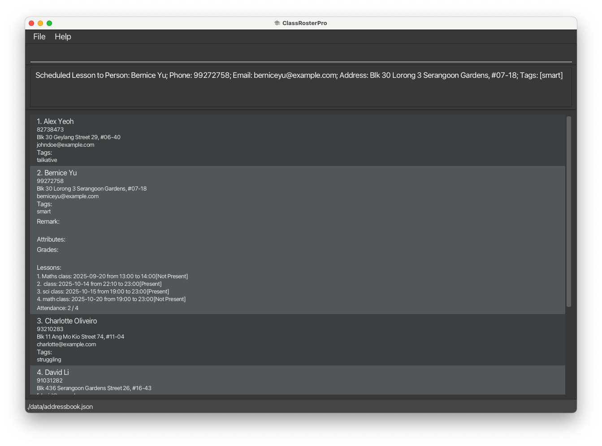

<em>Math lesson successfully scheduled for Bernice.</em>

### Unscheduling a lesson : `unschedule`

Removes a scheduled lesson from a student.

Format:
`unschedule INDEX lesson/LESSON_INDEX`

* Removes the lesson at `LESSON_INDEX` from the student at the specified `INDEX`.
* Both `INDEX` and `LESSON_INDEX` must be positive integers from their respective lists.
* `INDEX` refers to the student's position in the currently displayed person list.
* `LESSON_INDEX` refers to the lesson's position in that student's lesson list.
* The student must have at least one scheduled lesson.

Examples:
* `unschedule 1 lesson/1`

_Removes the 1st lesson from the 1st person in the current list._

:bulb: Tip:
Use this when a lesson is cancelled or completed and you want to clear the schedule for that student.

:warning: Common Mistake:
Using this command on a student who doesn't have any scheduled lessons - the command will have no effect.

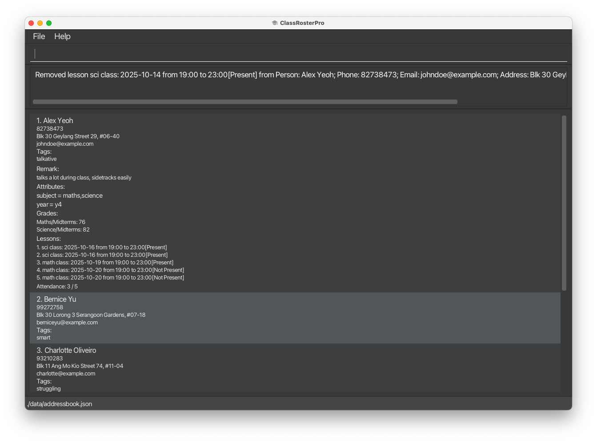

<em>Alex's Science lesson successfully removed</em>

### Marking attendance : `mark`

Marks a student as present for a scheduled lesson.

Format: `mark INDEX lesson/LESSON_INDEX`

*   Marks attendance for a lesson at the specified `LESSON_INDEX` of the student at the specified `INDEX`.
*   The `INDEX` refers to the index number shown in the displayed person list.
*   The `LESSON_INDEX` refers to the index number shown in the displayed lesson list.
*   The `INDEX` and `LESSON_INDEX` **must be a positive integer** 1, 2, 3, …​
*   Only lessons scheduled on the current date can be marked.

Examples:
* `mark 1 lesson/1`

_Marks the 1st person's 1 lesson in the current list as present_

:bulb: Tip:
Combine with the schedule command to maintain a complete teaching schedule.

:warning: Common Mistake:
Using this command on a student who doesn't have any scheduled lessons.

<em>Alex's attendance successfully marked as present.</em>

### Unmarking attendance : `unmark`

Unmarks a student's attendance for all the lessons that are scheduled on the current day.

Format: `unmark INDEX lesson/LESSON_INDEX`

*   Unmarks attendance for a Lesson at the specified `LESSON_INDEX`. of the Person at the specified `INDEX`.
*   The `INDEX` refers to the index number shown in the displayed person list.
*   The `LESSON_INDEX` refers to the index number shown in the displayed lesson list.
*   The `INDEX` and `LESSON_INDEX` **must be a positive integer** 1, 2, 3, …​
*   Only lessons that are currently marked as present will be unmarked.

Examples:
* `unmark 1 lesson/1`

 Unmarks the 1st person in the current list as absent for today's lesson.

:bulb: Tip:
Use this command to correct accidental marks or handle last-minute cancellations.

:warning: Common Mistake:
Using this command on a student who doesn't have any completed lessons to unmark.

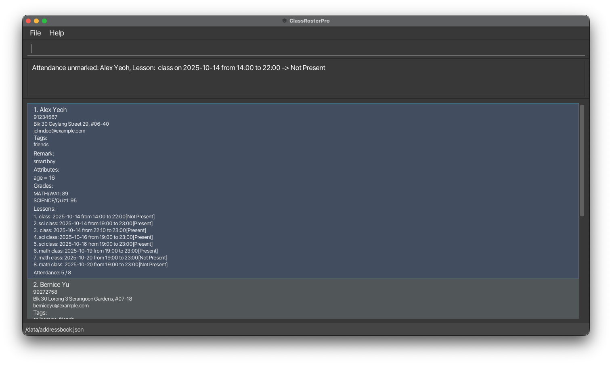

<em>Bernice's attendance successfully unmarked as not present.</em>

### Quick Search : `search`

Allows users to instantly search for contacts by name, email or phone number.

Format: `search [KEYWORD]`

*   Shows all contacts with their name, email, or phone number having a partial match with `KEYWORD`
*   The `KEYWORD` is case-insensitive 

Examples:
* `search alex`

 Displays contacts such as `Alex Yeoh`

* `search 9876` 

 Display contacts with phone number such as 9876123

* `search john12` 

 Displays contacts with email `john123@yahoo.com`

 :bulb: **Tip**
The Quick Search feature is ideal for quick lookups during lessons or when managing attendance.

<em>Figure: Result of searching a student's name.</em>

### Recording student grades : `grade`

Records and updates subject-assessment-score pairs for a student so tutors can keep a detailed grade book per student.

Format: `grade INDEX sub/SUBJECT/ASSESSMENT/SCORE [sub/SUBJECT2/ASSESSMENT2/SCORE2]…​`

* Records grades for the student at the specified `INDEX`.
* The index refers to the index number shown in the displayed student list.
* The index **must be a positive integer** 1, 2, 3, …​
* If a subject-assessment combination already exists for the student, the new score will **overwrite** the existing score.
* If the same subject-assessment appears multiple times in one command, the **last occurrence** wins.
* At least one `sub/` prefix must be provided.
* Subject, assessment, and score values cannot be empty.

Examples:
* `grade 2 sub/MATH/WA1/89 sub/SCIENCE/Quiz1/95`

 Records Math WA1 score as 89 and Science Quiz1 score as 95 for the 2nd student

* `grade 5 sub/ENGLISH/Final/88 sub/HISTORY/Midterm/92`

Records English Final score as 88 and History Midterm score as 92 for the 5th student

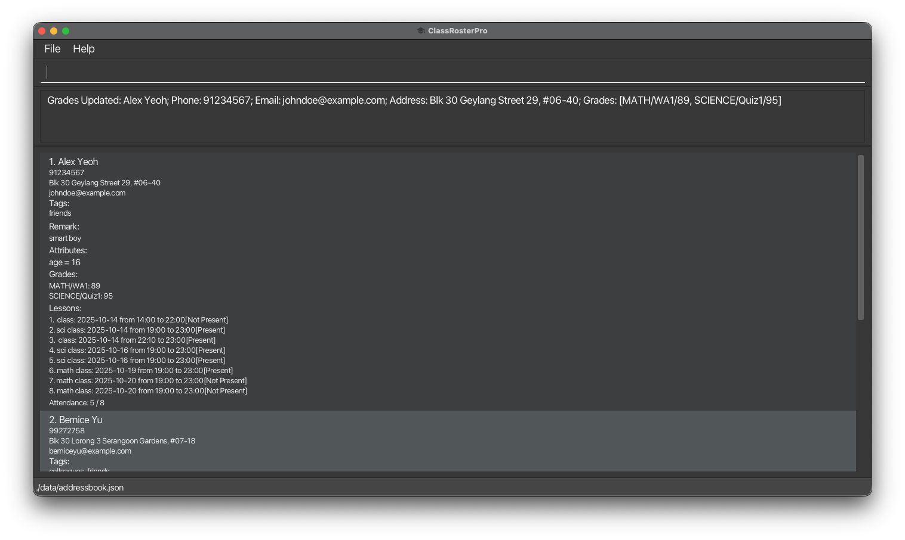

<em>Figure: Result of recording grades for a student.</em>

### Recording student grades : `remark`
Format: `remark INDEX r/REMARK1 [r/REMARK2]…​`

* Adds on to the remarks of the student at the specified INDEX.
* The index refers to the index number shown in the displayed student list.
* The index must be a positive integer 1, 2, 3, …
* If the remark field is left empty after `r/`, the existing remarks will be cleared.

Examples:

* `remark 2 r/Excellent progress this term`

Adds the remark “Excellent progress this term” to the 2nd student

* `remark 1 r/` 

Clears the existing remark of the 1st student

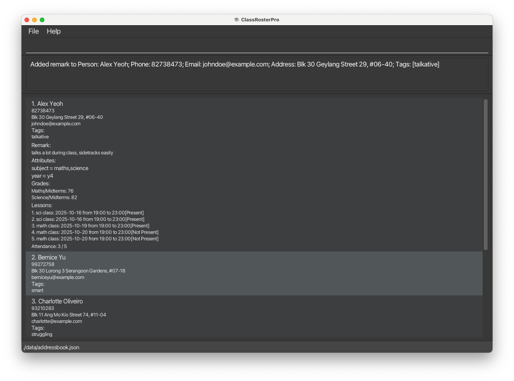

<em>Figure: Result of adding a remark for a student.</em>

### Clearing all entries : `clear`

Clears all entries from ClassRosterPro.

Format: `clear`

### Exiting the program : `exit`

Exits the program.

Format: `exit`

### Saving the data

ClassRosterPro data is saved in the hard disk automatically after any command that changes the data.
There is no need to save manually.

### Editing the data file

**ClassRosterPro** data is saved automatically as a JSON file `[JAR file location]/data/classrosterpro.json`.
Advanced users are welcome to update data directly by editing that data file.

:exclamation: Caution:
If your changes to the data file make its format invalid, ClassRosterPro will discard all data and start with an empty data file at the next run.
Hence, it is recommended to take a backup of the file before editing it. 
Furthermore, certain edits can cause **ClassRosterPro** to behave in unexpected ways
(e.g., if a value entered is outside of the acceptable range).
Therefore, edit the data file only if you are confident that you can update it correctly.

--------------------------------------------------------------------------------------------------------------------

## FAQ

**Q**: How do I transfer my data to another Computer? 
**A**: Install the app in the other computer and overwrite the empty data file it creates with the file that contains the data of your previous AddressBook home folder.

**Q**: Is there an undo command?
**A**: Currently, ClassRosterPro does not support an undo function. Please use commands with care, especially delete and clear.

**Q**: What happens if I forget to include a compulsory field when adding a student?
**A**: ClassRosterPro will show an error message explaining which field is missing and the correct format for the add command.

**Q**: Can I use the same attribute tags for multiple students?
**A**: Yes! That's the main purpose of tags. You can use the filter command to find all students with a specific tag.

**Q**: Can I see my teaching schedule for the week?
**A**: Currently, you need to check each student individually using the open command. Future versions may include a calendar view.

**Q**: Why can't I see all the details for a student?
**A**: Student cards start in a collapsed state to save space. Use the open INDEX command to expand a student's card and view all their details.

--------------------------------------------------------------------------------------------------------------------

## Known issues

1. **When using multiple screens**, if you move the application to a secondary screen, and later switch to using only the primary screen, the GUI will open off-screen. The remedy is to delete the `preferences.json` file created by the application before running the application again.
2. **If you minimize the Help Window** and then run the `help` command (or use the `Help` menu, or the keyboard shortcut `F1`) again, the original Help Window will remain minimized, and no new Help Window will appear. The remedy is to manually restore the minimized Help Window.

--------------------------------------------------------------------------------------------------------------------

## Glossary

| Term         | Definition                                                                                                                                  |
|--------------|---------------------------------------------------------------------------------------------------------------------------------------------|
| **CLI**      | Command Line Interface. The text-based area where you type commands.                                                                        |
| **GUI**      | Graphical User Interface. The visual part of the application with windows, buttons, and lists.                                              |
| **Command**  | An instruction you type to tell the app what to do (e.g., `add`, `list`).                                                                   |
| **Index**    | The number (starting from 1) next to a student's name in the displayed list. It's used to identify which student a command should apply to. |
| **Prefix**   | A short code (e.g., `n/`, `p/`, `attr/`) used to specify which parameter you are providing.                                                 |
| **Parameter**| The information you provide to a command (e.g., `John Doe` in `add n/John Doe`).                                                            |
| **Keyword**  | A word used for searching, especially with the `search` command.                                                                            |
| **Attribute**| A piece of information you can attach to a student using a key and a value (e.g., `subject=math`). Used for tagging and filtering.          |
| **Remark**   | A short, free-text note you can add to a student's profile to remember important details.                                                   |
| **Lesson**   | A scheduled class for a student, which includes a date, start time, end time, and subject.                                                  |
| **Attendance**| A record showing whether a student was present or not for a scheduled lesson.                                                               |

--------------------------------------------------------------------------------------------------------------------

## Command summary

Action | Format, Examples
--------|------------------
**Add** | `add n/NAME p/PHONE_NUMBER e/EMAIL a/ADDRESS [t/TAG]…​`   e.g., `add n/James Ho p/22224444 e/jamesho@example.com a/123, Clementi Rd, 1234665 t/friend t/colleague`
**Clear** | `clear`
**Delete** | `delete INDEX`  e.g., `delete 3`
**Edit** | `edit INDEX [n/NAME] [p/PHONE_NUMBER] [e/EMAIL] [a/ADDRESS] [t/TAG]…​`  e.g.,`edit 2 n/James Lee e/jameslee@example.com`
**Filter** | `filter attr/KEY=VALUE[,VALUE2]…​ [attr/KEY2=VALUE2]…​`  e.g., `filter attr/subject=math,science attr/age=16`
**Grade** | `grade INDEX sub/SUBJECT/ASSESSMENT/SCORE [sub/SUBJECT2/ASSESSMENT2/SCORE2]…​`  e.g., `grade 2 sub/MATH/WA1/89 sub/SCIENCE/Quiz1/95`
**Schedule Lesson** | `schedule INDEX start/START_TIME end/END_TIME date/DATE sub/SUBJECT`  e.g., `schedule 1 start/14:00 end/15:00 date/2025-09-20 sub/science`
**Unschedule Lesson** | `unschedule INDEX lesson/LESSON_INDEX`  e.g., `unschedule 1 lesson/1`
**Mark Attendance** | `mark INDEX lesson/LESSON_INDEX`  e.g., `mark 1 lesson/1`
**Unmark Attendance** | `unmark INDEX lesson/LESSON_INDEX`  e.g., `unmark 1 lesson/1`
**Tag Attributes** | `tag INDEX attr/KEY=VALUE[,VALUE2]…​ [attr/KEY2=VALUE2]…​`  e.g., `tag 2 attr/subject=math,science attr/age=16`
**Delete Attributes** | `deltag INDEX attr/KEY [attr/KEY2]…​`  e.g., `deltag 2 attr/age attr/subject`
**Remark** | `remark INDEX r/REMARK1 [r/REMARK2]…​`  e.g., `remark 2 r/Excellent progress this term`
**List** | `list`
**Help** | `help`
